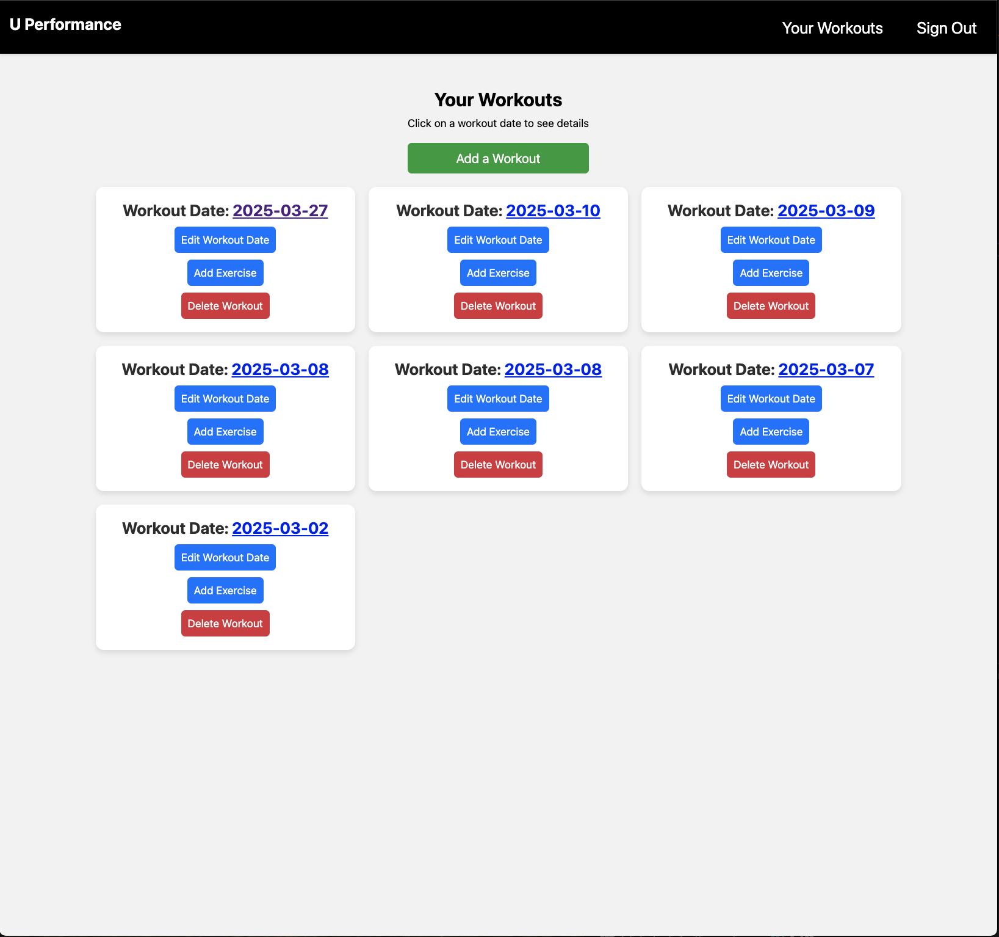
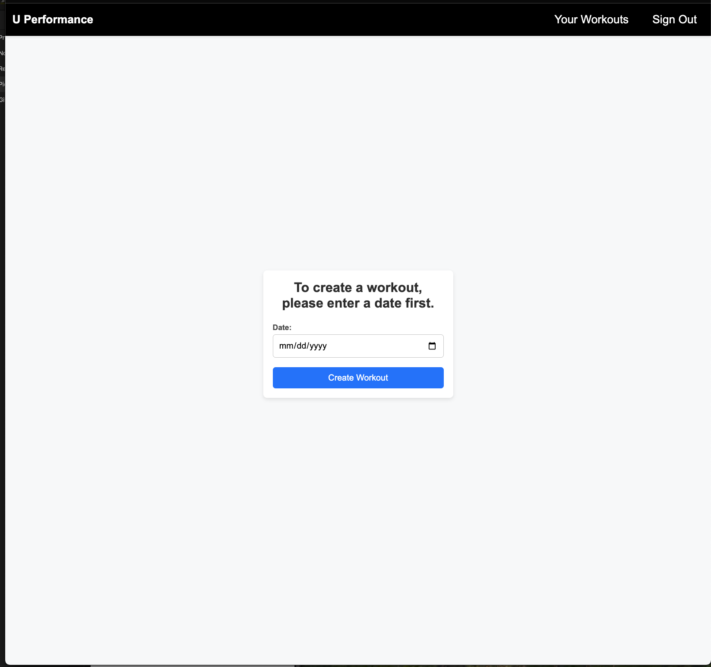
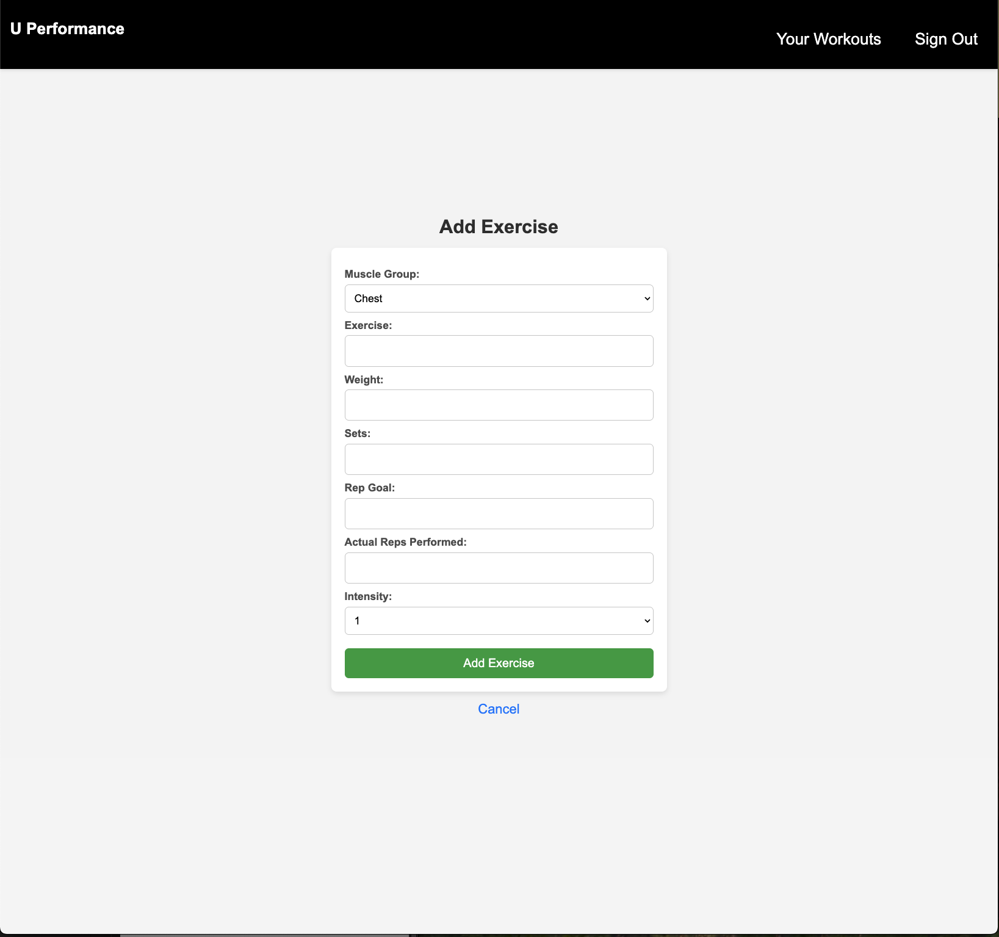

# U Performance 

U Performance is a simple application that allows users to journal their fitness journey.
By signing up, users can track and analyze their weight training workouts and
progress. 

# Functionality

- **User Authentication**: Secure sign-up and login functionality.
- **Workout Management**: Create, edit, and delete workouts. Create, edit, delete, exercises.
- **Exercise Tracking**: Log exercises with muscle groups, weight, sets, reps, and intensity.
- **Progress Monitoring**: View and analyze workout history.
- **Responsive Design**: Optimized for desktop and mobile devices.

# 💪 Why U Performance? 💪

This was a very personal project for me because throughout my life, I have struggled with my weight. I grew up a chubby kid and bigger than most my age. Right after high school,
I lost 80 lbs in four months, and admittedly, not in the most healthy way. After the initial
weight loss, my weight fluctuated and eventually I gained the weight back, and then some.
I decided I needed to make a change, so I started weight training and logged my workouts, making sure I incrementally progressed along the way. Tracking my workouts allowed me to track progress, or lack thereof, so I can adjust as needed. While I'm not at my goal weight, I have made strides
to ensure I stay on track, and logging workouts help tremendously. That's why I created this app.
This is for anyone who would like to start a fitness journey, whether to lose weight or get in shape, this app will aid in progress tracking.

# 🏋️‍♂️ Getting Started 🏋️‍♀️

### [Here is the link to the app](https://github.com/RConradG/u-performance.git)

### [Here is a link to my planning materials](https://trello.com/invite/b/67d44d5282ae62aeafc06857/ATTI168108b7c4d8ef0dbcee2bc81b11ee7974B15B71/project-2my-workouts-app)

Once users are signed in, they are brought to the main page that displays created workouts.
Users can create, add exercises, and delete their workouts from this main page. See the picture below.

To add a workout, users must first enter a date, then an initial exercise (see pictures below). There are several input
fields, which include muscle group, exercise, weight, sets, rep goal, actual reps performed and
intensity. While exercise, weight, and sets are self-explanatory, the other fields require explanation.

The rep goal field is the number of reps users aim to perform for that particular exercise.
For example, if a user plans to perform 10 reps of the bench press, said user would enter the
number 10 in the rep goal field.

Actual reps performed are the actual number of reps completed during the workout. Using
the example above, if the user actually performed 12 reps, the user would enter 12 in the field.
While users should strive to perform the rep goal number, it is perfectly acceptable to perform
reps lower or higher than the goal. This is how users can track progress and incrementally change
workout variables, such as the weight and number of sets.

The intensity field scales an exercises difficulty, from 1 to 5, where 1 being fairly easy to 
5 being the most challenging. Once again, using the example above, if the bench press felt
fairly easy to do, the user would enter 1. However, if the user could not complete the number
of reps entered in the rep goal field, the user should enter 5. 

# Attributions

### Here are the resources I researched build the app.

[CSS Signup Form](https://www.w3schools.com/howto/howto_css_signup_form.asp)

[CSS Opacity](https://www.w3schools.com/cssref/css3_pr_opacity.php)

[Background Image Opacity](https://coder-coder.com/background-image-opacity/)

[Blurred Background](https://www.w3schools.com/howto/howto_css_blurred_background.asp)

[HTML Tables](https://www.w3schools.com/html/html_tables.asp)

[CSS Grid](https://css-tricks.com/snippets/css/complete-guide-grid/)

[CSS Flexbox](https://css-tricks.com/snippets/css/a-guide-to-flexbox/)

[Create HTML CSS Cards](https://www.w3schools.com/howto/howto_css_cards.asp)

[Help with errors/debugging](chatgpt.com)

[Styling Buttons](https://www.w3schools.com/css/css3_buttons.asp)

# Technologies Used

JavaScript, Embedded JavaScript, HTML, CSS, Node.js, Express.js, MongoDB

# Next Steps

I plan on adding additional features and functionality in the future. I would like to add
progress line graphs to track progress for particular exercises, workout templates, easily
copy workouts, and links to exercise instructions.
